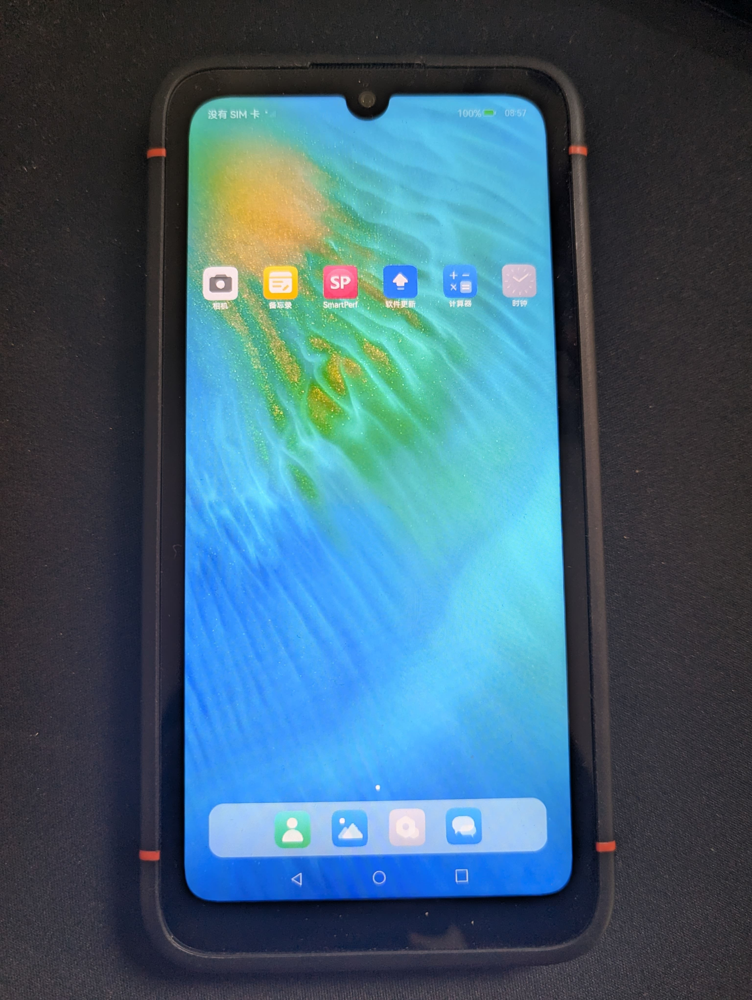
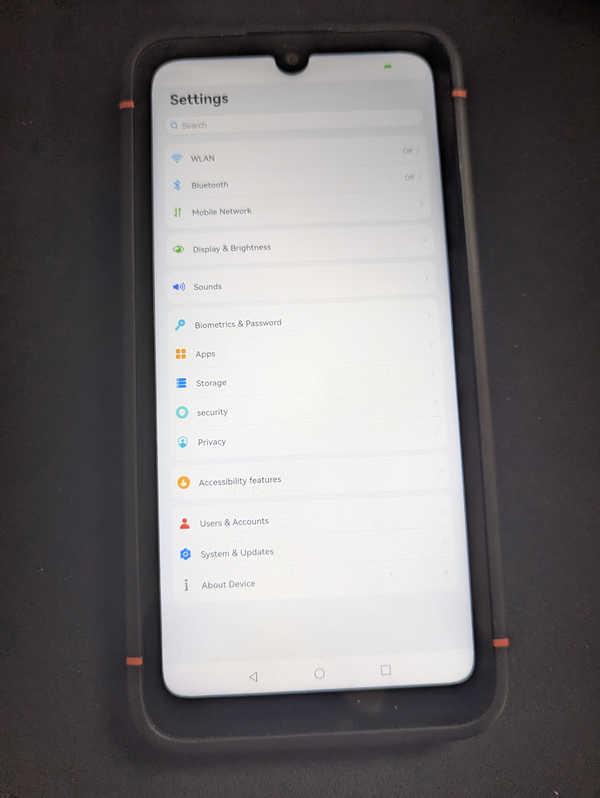

# Oniro Board Support Packages

This documentation provides instructions for building and flashing Oniro on the Volla X23 device.

## Building and Flashing for Volla X23

Follow the steps below to prepare the build environment, compile the system image, and deploy Oniro on the Volla X23. Make sure you have completed the initial steps from the [quick build documentation](https://docs.oniroproject.org/quick-build.html) to set up your build environment.

### Step 1: Prepare the Build Environment

First, apply the necessary system patches to your environment:

```bash
chmod +x device/board/oniro/system_patch/system_patch.sh
./device/board/oniro/system_patch/system_patch.sh
```

### Step 2: Compile the System Image

Next, compile the root filesystem (rootfs) for the Volla X23:

```bash
./build.sh --product-name x23 --ccache
```

This will generate the system image with ccache enabled for faster builds.

### Step 3: Deploy RootFS and LXC Container

To run Oniro in an LXC container on the Volla X23, the device must be flashed with Ubuntu Touch. You can use the [UBports Installer](https://devices.ubuntu-touch.io/device/vidofnir/) to flash Ubuntu Touch onto your device.

Once Ubuntu Touch is successfully booted on the device, connect the Volla X23 to your PC and verify that it is recognized using ADB:

```bash
adb devices
```

With a proper ADB connection, deploy the Oniro rootfs along with the LXC container configuration and systemd service using the following commands:

```bash
chmod +x ./device/board/oniro/x23/utils/deploy-lxc-container.sh
./device/board/oniro/x23/utils/deploy-lxc-container.sh
```

This script will transfer the rootfs to the device, configure the LXC container, and set up a systemd service to start Oniro automatically.

### Screenshots

