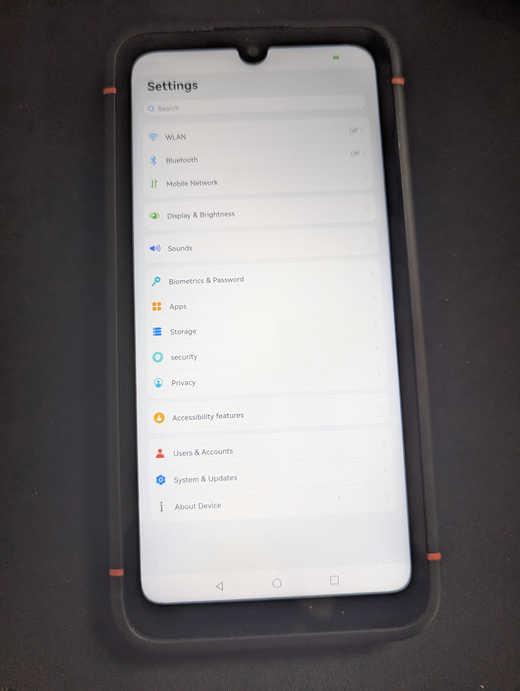

# Volla X23

This documentation provides instructions for building and flashing Oniro on the Volla X23 device.




## Building and Flashing for Volla X23

Follow the steps below to prepare the build environment, compile the system image, and deploy Oniro on the Volla X23. Make sure you have completed the initial steps from the [quick build documentation](https://docs.oniroproject.org/quick-build.html) to set up your build environment.

### Step 1: Prepare the Build Environment

First, apply the necessary system patches to your environment:

```bash
chmod +x device/board/oniro/system_patch/system_patch.sh
./device/board/oniro/system_patch/system_patch.sh
```

### Step 2: Compile the System Image

Next, compile the root filesystem (rootfs) for the Volla X23:

```bash
./build.sh --product-name x23 --ccache
```

This will generate the system image with ccache enabled for faster builds.

### Step 3: Deploy RootFS and LXC Container

To run Oniro in an LXC container on the Volla X23, the device must be flashed with Ubuntu Touch. You can use the [UBports Installer](https://devices.ubuntu-touch.io/device/vidofnir/) to flash Ubuntu Touch onto your device.

Once Ubuntu Touch is successfully booted on the device, connect the Volla X23 to your PC and verify that it is recognized using ADB:

```bash
adb devices
```

With a proper ADB connection, deploy the Oniro rootfs along with the LXC container configuration and systemd service using the following commands:

```bash
chmod +x ./device/board/oniro/x23/utils/deploy-lxc-container.sh
./device/board/oniro/x23/utils/deploy-lxc-container.sh
```

This script will transfer the rootfs to the device, configure the LXC container, and set up a systemd service to start Oniro automatically.

Here's an improved and detailed version of the instructions with added comments and descriptions for clarity:

## Build and deploy the Volla X23 kernel with custom Oniro patches

Follow the steps below to set up the build environment, apply patches, compile the kernel, and deploy the resulting images and modules.

### **1. Set up repositories for Volla X23 kernel and boot images**

Clone the repository that contains the Volla X23 kernel and boot image build scripts. Then, navigate to the repository directory and initialize the build system.

```bash
# Clone the Volla X23 repository from GitLab
git clone https://gitlab.com/ubports/porting/reference-device-ports/halium12/volla-x23/volla-vidofnir.git ~/volla-vidofnir

# Navigate to the repository directory
cd ~/volla-vidofnir

# Initialize the build environment (creates necessary directories and downloads dependencies)
./build.sh -b build-dir -c
```

---

### **2. Apply Oniro-specific kernel patches**

Apply custom patches to the kernel source code to enable compatibility with the Oniro Project. You will need to have the OpenHarmony build environment set up for this step.

1. **Set the environment variable for OpenHarmony**:
   ```bash
   export OHOS_DIR=<path-to-OpenHarmony-build-environment>
   ```

2. **Apply the patches**:
   ```bash
   # Apply the kernel configuration fragment patch
   git apply ${OHOS_DIR}/device/board/oniro/x23/patches/0001-deviceinfo-add-openharmony-kernel-config-fragment-an.patch

   # Apply OpenHarmony adaptation patches to the kernel source
   git apply ${OHOS_DIR}/device/board/oniro/x23/patches/0001-OpenHarmony-4.1-Release-adaptation.patch --directory=build-dir/downloads/kernel-volla-mt6789
   git apply ${OHOS_DIR}/device/board/oniro/x23/patches/0002-Makefile-adapting-KBUILD_CFLAGS-for-OpenHarmony-patc.patch --directory=build-dir/downloads/kernel-volla-mt6789
   git apply ${OHOS_DIR}/device/board/oniro/x23/patches/0003-add-openharmony.config-config-fragment-to-enable-oho.patch --directory=build-dir/downloads/kernel-volla-mt6789

   # Apply the HDF (Hardware Driver Foundation) patch to the kernel
   (cd build-dir/downloads/kernel-volla-mt6789 && \
   bash ${OHOS_DIR}/drivers/hdf_core/adapter/khdf/linux/patch_hdf.sh ${OHOS_DIR}/ $(pwd) ${OHOS_DIR}/kernel/linux/patches/linux-5.10/ mt6789)
   ```
   **Note:** Ensure all patches are applied successfully without any errors. Review the patch log for conflicts or failures.

---

### **3. Build the kernel**

Compile the kernel using the build script. You need elevated permissions (`sudo`) for this step due to potential access restrictions on certain system resources.

```bash
# Start the kernel build process with the specified product path
sudo PRODUCT_PATH=vendor/oniro/x23 ./build.sh -b build-dir -k
```

**Explanation of parameters**:
- `-b build-dir`: Specifies the build directory to use.
- `-k`: Triggers the kernel build.

---

### **4. Deploy boot images and kernel modules**

After successfully building the kernel, you need to deploy the new boot images and kernel modules to the device.

1. **Package the kernel modules**:
   ```bash
   # Create a compressed tarball of the compiled kernel modules
   (cd build-dir/tmp/system/lib/modules && tar czf ../../../../../modules.tar.gz . --owner=0 --group=0)
   ```

2. **Transfer the files to the device**:
   ```bash
   # Push the tarball and boot images to the device's temporary directory
   adb push modules.tar.gz build-dir/tmp/partitions/*boot.img /tmp
   ```

3. **Install the kernel modules and boot images on the device**:
   ```bash
   # Access the device shell with superuser privileges
   adb shell
   sudo su

   # Remount the root filesystem as writable
   mount -o remount,rw /

   # Extract the kernel modules to the appropriate directory
   tar -xvf /tmp/modules.tar.gz -C /lib/modules

   # Determine the current boot slot (e.g., _a or _b)
   slot=$(getprop ro.boot.slot_suffix)

   # Flash the boot image to the correct partition
   cat /tmp/boot.img > /dev/disk/by-partlabel/boot${slot}

   # If a vendor boot image is present, flash it as well
   [ -f /tmp/vendor_boot.img ] && cat /tmp/vendor_boot.img > /dev/disk/by-partlabel/vendor_boot${slot}

   # Reboot the device to apply the changes
   reboot
   ```

