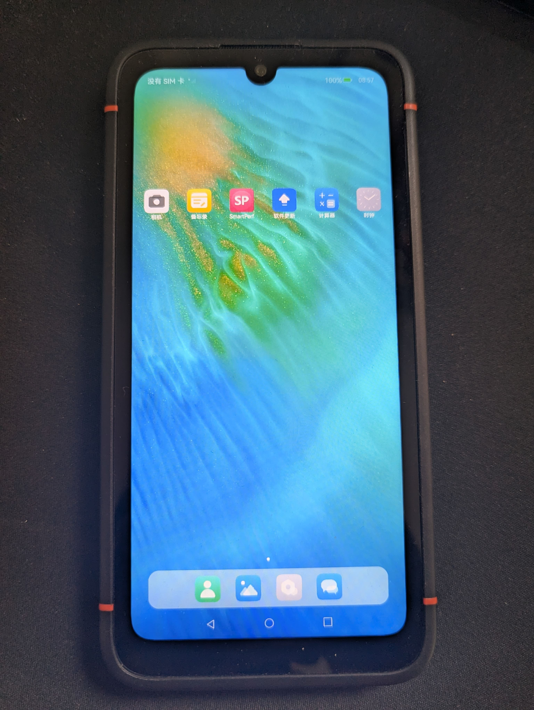
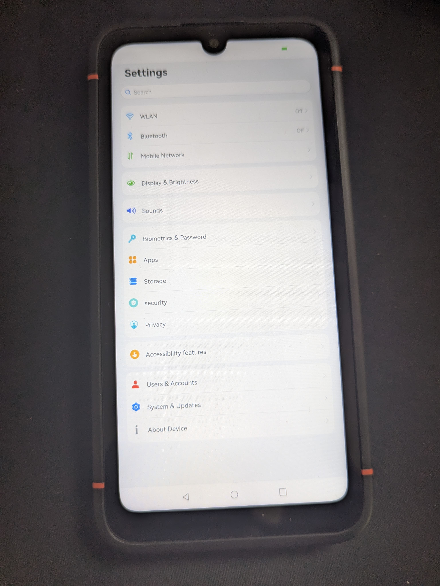

# Volla X23

Build and deploy **OpenHarmony (Oniro)** on the Volla X23 phone using the
`hybris_generic` target. Oniro boots **natively** — there is no Ubuntu Touch
host and no LXC container. A Halium boot image chain-loads directly into OHOS
`init` (`OHOS_NATIVE_BOOT=1 chroot`), and a companion `androidd` process runs
the device's Android (Halium) HAL services in a child mount/PID namespace so the
OHOS graphics/HAL stack can reach the MediaTek hardware through **libhybris**.




> **The earlier LXC path is retired.** Oniro previously ran as an LXC guest on
> top of an Ubuntu Touch / Halium host. That approach is no longer used — its
> container infrastructure (LXC config, start/stop hooks, deploy scripts) has
> been removed. The per-feature bring-up notes from that era are kept as
> `legacy_*.md` references under [docs/hybris_generic/](hybris_generic/README.md);
> most of their HAL/driver detail still applies under native boot.

## Prerequisites

- **Volla X23** (`vidofnir`, MT6789 / Helio G99, aarch64) with an unlocked
  bootloader.
- **`fastboot`** (Android platform-tools) on the host.
- An **aarch64 USB host** (e.g. a Raspberry Pi) to relay `hdc` — the X23
  enumerates as an aarch64 hdc device, so a non-aarch64 dev machine cannot talk
  to it directly. See [HDC_AARCH64_HOST.md](hybris_generic/HDC_AARCH64_HOST.md).
- An OHOS source tree and build container (see the
  [emulator README](../README.md#-set-up-the-build-container) for the Docker
  image).
- **Halium 12 blobs** for the X23, fetched host-side (SHA256-pinned). These
  provide the Android `system`/`vendor` HALs and the reused boot image; they are
  required for graphics but an OHOS-only image builds without them.

## Build

```bash
# 1. Build the OHOS rootfs (system / vendor / sys_prod / chip_prod images).
./build.sh --product-name hybris_generic --ccache

# 2. (once) Fetch the Halium Android system/vendor/boot blobs.
bash device/board/oniro/hybris_generic/utils/host/pull-halium-blobs.sh

# 3. Pack the LP-formatted `super` image (OHOS + Halium logical partitions).
bash device/board/oniro/hybris_generic/kernel/x23/build_super_img.sh

# 4. Build the chain-load boot image (Halium boot.img with /init replaced).
bash device/board/oniro/hybris_generic/kernel/x23/build_boot_img_chainload.sh
```

Artifacts land in `out/hybris_generic/` — `super.img` and `boot-chainload.img`.

**Kernel (optional).** The chain-load boot image can carry the OHOS-patched
kernel (staging drivers: `access_tokenid`, `hilog`, `hievent`, binder
token-id). Build it — and its matching `vendor_boot.img` modules — with:

```bash
bash device/board/oniro/hybris_generic/kernel/x23/build_kernel.sh
```

Output (`boot.img`, `vendor_boot.img`, `dtbo.img`, `modules.tar.gz`) lands in
`kernel/linux/volla-vidofnir/out/`. `build_boot_img_chainload.sh` picks up this
kernel automatically when present; the matching `vendor_boot.img` must be
flashed too, or drivers fail with a vermagic mismatch.

## Flash

Put the device into LK fastboot (hold **Volume-Down + Power**, or
`hdc shell "reboot bootloader"`), then flash `super`, `boot_a`, and
`vendor_boot_a` in a single pass:

```bash
bash device/board/oniro/hybris_generic/utils/host/flash-native.sh
```

No `fastbootd` switch is needed — `super` is written as a whole physical
partition.

## Verify

~60–70 s after reboot the device enumerates over USB as `12d1:5000 "Phone X23"`
and answers hdc (relayed through the aarch64 USB host):

```bash
hdc list targets
hdc shell "uname -a"          # aarch64, Linux 5.10.x
```

The OHOS lockscreen renders on the physical 720×1560 panel.

## Architecture

```
  MTK LK bootloader
        │  (loads boot_a — a modified Halium boot.img)
        ▼
  Linux kernel  +  Halium ramdisk   (ramdisk /init = init-chainload.sh)
        │  • modprobe vendor modules  • parse-android-dynparts → /dev/mapper/*
        │  • mount OHOS system_a at /root, Halium system at /root/android
        ▼
  exec env OHOS_NATIVE_BOOT=1 chroot /root /system/bin/init --second-stage
        │  (kernel keeps PID 1 across exec — OHOS init becomes PID 1)
        ▼
  OHOS userspace: samgr, hdf, render_service, launcher …
        └── androidd → clone() child NS → Halium /system/bin/init
                        → hwservicemanager, composer@2.x, gralloc@4.0 (Android HALs)
```

The build ships a single custom `super` partition (LP-formatted) with six
logical partitions:

| Logical partition | Contents |
|---|---|
| `system_a` | OHOS system (becomes `/` after chroot) |
| `vendor_a` | OHOS vendor |
| `sys_prod_a` / `chip_prod_a` | OHOS sys_prod / chip_prod |
| `halium_system_a` | Halium 12 Android `/system` (HAL runtime) |
| `halium_vendor_a` | Halium 12 MTK `/vendor` (Mali EGL, HAL binaries) |

Android's `hwbinder`/`vndbinder` are shared between the OHOS root namespace and
`androidd`'s Halium namespace — that shared binder is the bridge over which
libhybris-based OHOS services (`composer_host`, `allocator_host`) call into the
Halium HAL services. libhybris loads the Android EGL/HWC2/gralloc `.so`s with an
embedded bionic linker and remaps `/system`,`/vendor` to `/android/...`.

For the complete structure — chainload internals, `androidd`, binder layout, and
the graphics data path — see
[hybris_generic/ARCHITECTURE.md](hybris_generic/ARCHITECTURE.md).

## Status & further documentation

Native boot, USB hdc, display (OHOS lockscreen on the panel), touch, WiFi, and
audio work end-to-end on the Volla X23; Bluetooth and sensors are in progress.

- **Roadmap, current status, and per-phase bring-up docs** —
  [hybris_generic/README.md](hybris_generic/README.md)
- **Running-system architecture** —
  [hybris_generic/ARCHITECTURE.md](hybris_generic/ARCHITECTURE.md)
- **Original native-boot design rationale** —
  [hybris_generic/native_boot_design.md](hybris_generic/native_boot_design.md)
- **aarch64 hdc USB host setup** —
  [hybris_generic/HDC_AARCH64_HOST.md](hybris_generic/HDC_AARCH64_HOST.md)
